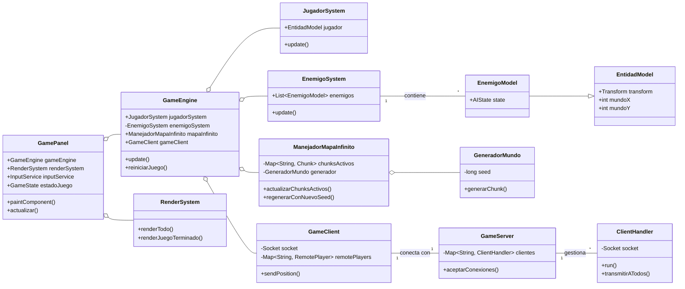

# Diagrama de Clases UML del Proyecto

Este documento contiene el diagrama de clases UML en formato Mermaid.
Este diagrama visualiza la estructura estática del sistema, mostrando las clases principales, sus atributos, métodos y las relaciones entre ellas.

## Diagrama

